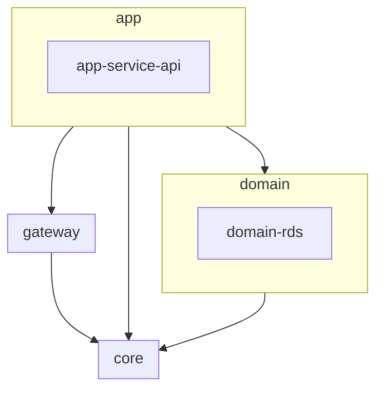

# 플러팅: 직장인 MBTI 소개팅 앱

> **플러팅**은 회사 이메일을 통해 인증하고 MBTI와 위치 기반으로 매칭되는 소개팅 앱입니다.

## 모듈 계층 구성
플러팅 api는 멀티 모듈 프로젝트로 구성되어 있습니다.



참고: [멀티모듈 설계 이야기 with Spring, Gradle](https://techblog.woowahan.com/2637/)

### app
> 독립적으로 실행가능한 애플리케이션 모듈 계층
- `app-service-api`: 플러팅 앱 서비스 API (**port: 8880**)

### core
> 공통 모듈 (Type, Util..)

### domain
> 시스템의 중심 도메인을 다루는 모듈
- `domain-rds`: 회원 도메인

### gateway
> 클라이언트과 호출하는 부분들에 대한 인터페이스와 행동,행위 등에 해당하는 기능을 작업합니다.


## 시작하기
```bash
$ docker-compose up -d
```