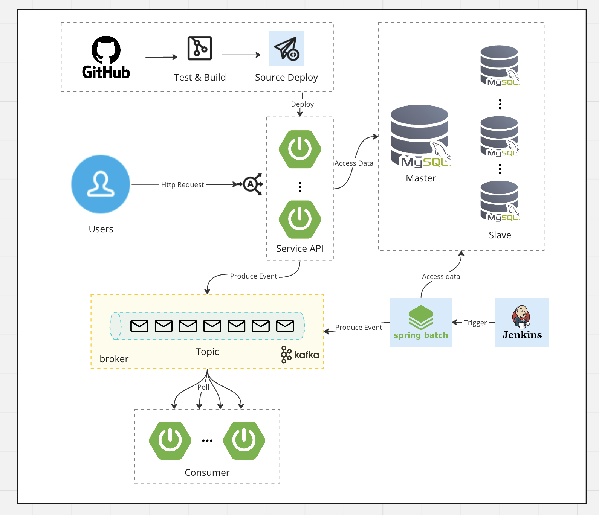

## 플러팅: 직장인 MBTI 소개팅 앱

> **플러팅**은 회사 이메일을 통해 인증하고 MBTI와 위치 기반으로 매칭되는 소개팅 앱입니다.

## 기술 스택

## 서버 아키텍처

## 모듈 계층 구성
플러팅 api는 멀티 모듈 프로젝트로 구성되어 있습니다.

참고: [멀티모듈 설계 이야기 with Spring, Gradle](https://techblog.woowahan.com/2637/)

### 애플리케이션
> 독립적으로 실행가능한 애플리케이션 모듈 계층
- `app-service-api`: 플러팅 앱 서비스 API (**port: 8880**)
- `app-point-consumer`: 포인트 이벤트 컨슈머 (**port: 8881**)

### 공통
> 공통 모듈 (Type, Util..)
- `core`: 공통 모듈

### 도메인
> 시스템의 중심 도메인을 다루는 모듈
- `domain-rds`: 관계형 데이터베이스 도메인
- `domain-redis`: Redis 도메인

### 내부모듈
> 시스템 전체적인 기능을 서포트하기 위한 기능 모듈
- `gateway`: API Gateway
- `notification`: 알림 모듈

## API 명세서
- [API 명세서](https://documenter.getpostman.com/view/9820015/2s9YJXYPqg)

## ERD
